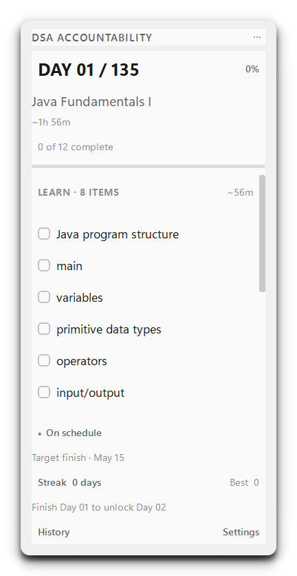

# DSA Accountability

A local-first Windows desktop app for following a 135-day Java data-structures
and algorithms plan. It combines completion-gated progression, local Java
validation, fresh LeetCode Accepted detection, reflections, spaced revision,
and safe Git/GitHub sync without solving or submitting questions for you.

## What it does

- Shows the earliest incomplete curriculum day in a compact desktop overlay.
- Lets each new user choose their own Day 1; Day 135 is derived as Day 1 + 134.
- Opens canonical Java exercise files in VS Code and verifies them with real
  `javac`/`java` execution and functional tests.
- Uses an unpacked Chrome Manifest V3 extension to recognize a newly submitted,
  fresh Java Accepted result on LeetCode and capture the code already in the
  editor.
- Collects the learner's explanation, complexity, assistance level, and
  confidence before recording work.
- Creates narrow local Git commits that stage only the completed task's files.
- Optionally pushes to GitHub; offline failures remain queued for retry while
  the successful local commit keeps the work valid.
- Schedules revisions at D+2, D+7, D+21, and D+45; Red confidence also adds
  earlier D+1 and D+3 reviews.

The application repository never contains a user's progress database, pairing
token, learner code, Git credentials, or Chrome profile.

## Screenshot



This image is rendered from a disposable fresh database with no personal path,
account, token, or completed progress.

## How progression works

`active day = earliest incomplete curriculum day`

If Day 1 is due Monday and you skip Monday, the app still shows Day 1 on
Tuesday. Completing Day 1 immediately unlocks Day 2. Calendar time measures
delay; it never skips required work.

## Requirements

- Windows 10 or 11 (x64)
- Java JDK 17 or newer (`java` and `javac` on `PATH`)
- Git for Windows
- Google Chrome for the LeetCode integration
- VS Code is recommended for local exercises
- Source builds: Python 3.12 or newer, PowerShell, and Node.js for extension tests

## Quick start

### Prebuilt Windows release

1. Download and extract `DSAAccountability-Windows-x64-v1.1.0.zip` from the
   repository's Releases page.
2. Run `DSAAccountability.exe`.
3. Choose your start date, learner repository, GitHub preference, and Windows
   startup preference in First Run Setup.
4. Load the included `chrome-extension` folder through
   `chrome://extensions` → Developer mode → Load unpacked.
5. Pair once with the token shown by the app.

See [Getting Started](docs/GETTING_STARTED.md) and
[Installation](docs/INSTALLATION.md) for the complete manual path.

### Build from source

```powershell
git clone https://github.com/anmol-228/DSA-Accountability.git
cd DSA-Accountability
.\scripts\setup.ps1 -RunTests
.\scripts\run-dev.ps1
```

Build and package:

```powershell
.\scripts\build.ps1
.\scripts\package-release.ps1 -SkipBuild
```

## Daily workflows

- [User guide](docs/USER_GUIDE.md)
- [Curriculum and schedule](docs/CURRICULUM_AND_SCHEDULE.md)
- [Local Java workflow](docs/LOCAL_JAVA_WORKFLOW.md)
- [LeetCode integration](docs/LEETCODE_INTEGRATION.md)
- [Git and GitHub integration](docs/GIT_GITHUB_INTEGRATION.md)
- [Chrome extension setup](docs/CHROME_EXTENSION.md)

An example learner-repository structure is available in the public
[DSA-135 journey](https://github.com/anmol-228/DSA-135). It is personal
progress, not bundled sample data.

## Build, test, and develop

- [Build from source](docs/BUILD_FROM_SOURCE.md)
- [Testing](docs/TESTING.md)
- [Architecture](docs/ARCHITECTURE.md)
- [Developer guide](docs/DEVELOPERS.md)
- [Contributing](CONTRIBUTING.md)

Run all automated checks:

```powershell
.\scripts\test.ps1
```

The test environment redirects all defaults to pytest-owned temporary folders
and rejects access to protected production paths. CI runs only isolated tests;
it never uses LeetCode accounts or pushes to a real GitHub repository.

## Configuration, safety, and help

- [Configuration](docs/CONFIGURATION.md)
- [Security and privacy](docs/SECURITY_PRIVACY.md)
- [Troubleshooting](docs/TROUBLESHOOTING.md)
- [Backup, update, and uninstall](docs/MAINTENANCE.md)
- [FAQ](docs/FAQ.md)
- [Security reporting](SECURITY.md)

Runtime data is stored under `%LOCALAPPDATA%\DSAAccountability`. The localhost
API binds to `127.0.0.1` and requires the locally generated pairing token.
Never publish that token or copy a live WAL database as a raw single file; use
the app's SQLite backup function.

## License

Released under the [MIT License](LICENSE).
