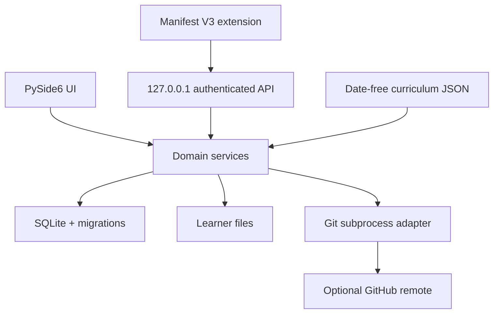

# Architecture

## Components

- `app/ui`: overlay, dialogs, first run, history, settings, and theme.
- `app/services`: progression, schedule, onboarding, Java validation, code
  sync, LeetCode sessions, revisions, Git/GitHub, backups, startup, recovery.
- `app/api/local_server.py`: loopback-only extension API.
- `app/database.py` and `app/migrations`: SQLite connection/migration layer.
- `curriculum`: reference content source and generated resources.
- `chrome-extension`: service worker, popup, content script, page bridge.
- `tests` / `tests_js`: isolated Python and browser-extension suites.

## Runtime environments

`PRODUCTION`, `DEVELOPMENT`, `TEST`, and `LIVE_INTEGRATION_TEST` have explicit
resource boundaries. Packaged and source development use different AppData
roots. Pytest-owned paths are mandatory in TEST; central DB/repo/file guards
reject protected user resources.

## Key invariants

- Earliest incomplete day determines progression.
- Curriculum content is date-free; user schedule is persisted instance state.
- Successful local Git commit gates archived code tasks; GitHub is best effort.
- Only a Submit-armed, fresh, current Java Accepted event is eligible.
- Test/integration repositories are disposable and never the learner tree.
