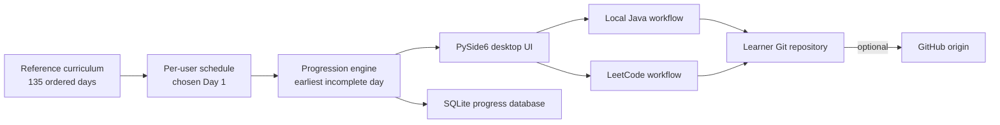
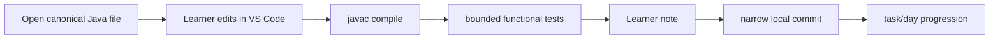

# How it works

## Desktop and database

PySide6 provides the overlay, task dialogs, Settings, History, and tray. SQLite
stores settings, curriculum instances, task state, sessions, reflections,
revisions, audit records, Git commits, and the push queue. Migrations are
versioned and preceded by an Online Backup API snapshot.

## Local exercise flow

## LeetCode and pairing

The extension stores a random token and calls a token-authenticated loopback
API. Page-open starts a problem session. A user Submit click arms detection;
only a matching fresh Java Accepted result can close the session and request a
reflection.

## GitHub failure handling

A local commit is recorded before any push. If auto-push is enabled and a
remote exists, the app pushes. Transient failure creates a durable queue row;
later retries never create a second commit and are bound to the recorded repo.

## Revision scheduling

Newly completed problems schedule D+2, D+7, D+21, and D+45 reviews. Red
confidence uses D+1, D+3, D+7, D+21, and D+45. Daily generation is capped to
avoid an unbounded review pile.
