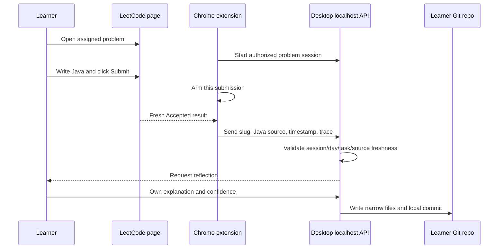

# LeetCode integration

The included Manifest V3 extension runs on `leetcode.com/problems/*` and talks
only to the desktop API on `127.0.0.1`.

## Fresh Accepted flow

Accepted is counted only after a current Submit action arms detection. The
backend also requires a current authorized session, matching problem/task/day,
Java language, a fresh source, and a bounded timestamp. Reloading a historical
Accepted page does not become new work.

The extension does **not** solve questions, write answers, click Submit, bypass
LeetCode, read cookies/passwords, or convert old Accepted results into progress.
The user always authors and submits the solution.

Common failures are covered in [Troubleshooting](TROUBLESHOOTING.md).
